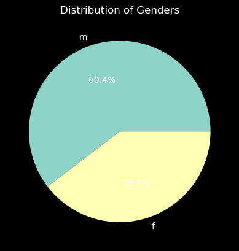
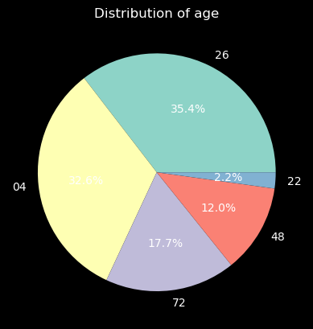
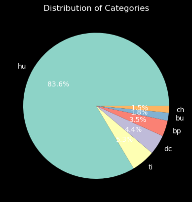
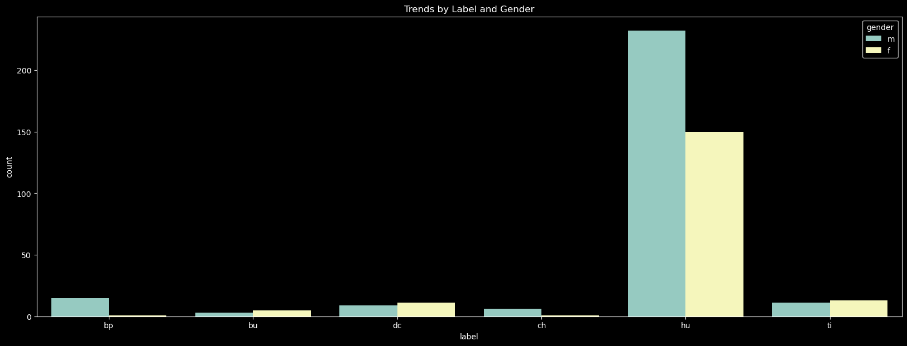
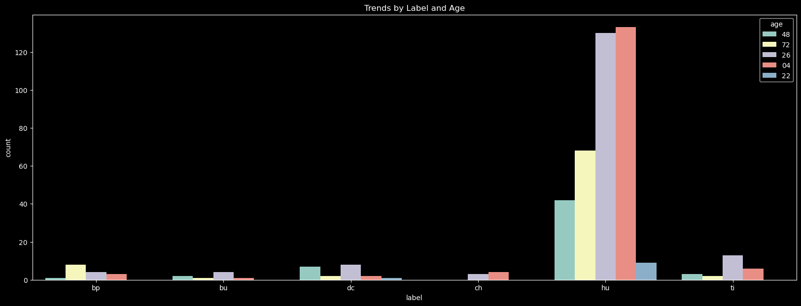
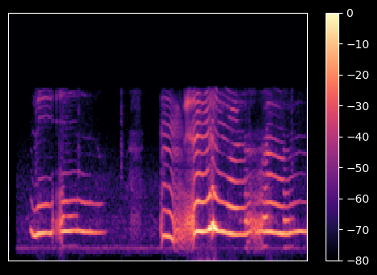

# Decoding Infant Cries: An Investigation using the Donate-a-cry Corpus

- *Author:* Manideep Akam
- *Term:* Summer 2023
- *PPT:* (https://github.com/manideep2009mar/manideep_data606/blob/main/docs/capstone.pptx)
- *Youtube:* (https://youtu.be/nmoZfgHw7lI)
- *GitHub:* (https://github.com/manideep2009mar/manideep_data606.git)

## Background

Infants are unable to communicate verbally until a certain stage of development. Instead, they convey their discomfort through crying, a form of expression that caregivers like babysitters, nannies, and childcare providers become adept at interpreting, unlike new parents who might find it more challenging. These experienced caregivers recognize patterns and can respond appropriately—an ability that could be challenging for parents new to the experience. Developing machine learning models to analyze crying patterns and determine the underlying reasons could greatly benefit both new parents and caregivers in promoting infant well-being. Such a model could even be integrated into baby monitors.

However, accurately deciphering the various types of infant cries presents a notable difficulty, impeding timely and suitable responses to their distress. Our limited grasp of cry patterns and the absence of systematic analysis, along with the impact of factors like age and health status, constrain our capacity to effectively address infant needs. Therefore, it is crucial to establish robust methodologies and insights for categorizing cries and identifying connections with contextual elements. This would enable an enhanced ability to recognize and respond to infant distress more effectively.

## Data sources 
The DonateaCry Corpus is a valuable asset containing audio recordings of infant cries. These cries were gathered from a variety of infants with varying health conditions. This dataset provides an extensive and thorough assortment of cry sounds, covering a range of distress types including cries due to hunger, pain, and discomfort. This collection proves to be an extremely useful resource for studying the attributes, trends, and potential cues linked to infant distress.  
Link: (https://github.com/gveres/donateacry-corpus/)

## Data elements

Dataset has just audio files and their metadata incorported in their filenames. Librosa library is used to load the audio recordings and extract relevant features from the cry signals.

| Name | Description |
| ----------- | ----------- |
| filename | Name of the file |
| gender | gender of the baby |
| age   | Age group of the baby |
| label | Reason for cry |
| duration | Length of the recording in seconds |
| features | Melspectrogram of the audio |

## Results of EDA 

- Dataset has 457 recordings
- Duration around 7 seconds 
- No null values
- No discrepencies found on gender, age, label columns
-   
-  
-  
-  
-  
- 2D image representation of a baby cry  
   

## Results of ML (training, evaluation, deployment, etc.), 

| Model | Training | Evaluation |
| ----------- | ----------- | ----------- |
| Simple CNN | 94.79| 77.17 |
| CNN with multiple convolution layers | 96.99 | 70.65 |
| CNN with Dropout Regularization | 93.97 | 77.17 |
| CNN with Learning Rate Scheduler | 90.96 | 76.08 |
| CNN with class_weight | 94.79 | 72.82 |
| One vs Remaining | 96.71 | 77.17 |

CNN model with Dropout Regularization has less evaluation loss than other models. It is deployed locally on streamlit and tested successfully.

## Conclusion 

Models have done decent job with available limited data, can perform better with training on more data. 

## Future research direction

- Create another model similar to baby monitors to detect the cry and trim the needed portion and feed it to the existing model
- Extract data from other sources such as Environmental sounds dataset that also consists infants cry
- Try Machine learning algorithms and pretrained models